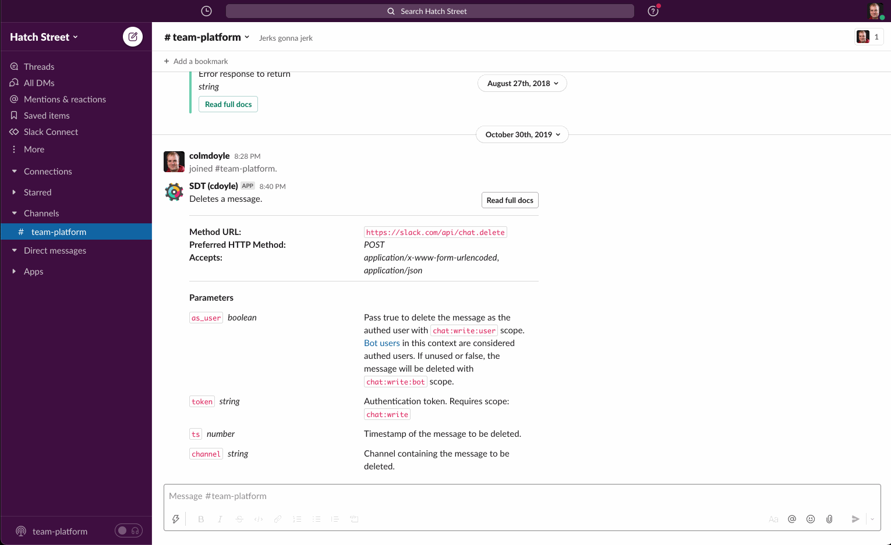

# Tasks App

🚨 This app is under active development. 🚨

Tasks App is a sample Task Management app built on the [Slack Platform](https://api.slack.com). To learn more about it, check out this [blog post](https://slack.com/intl/en-ie/blog/developers/sharpen-development-skills-tasks-app) or watch this ongoing series of videos on [YouTube](https://youtube.com/playlist?list=PLWlXaxtQ7fUb0B4uNTKirvrQ0JOTCBFae)

We've begun development using Bolt for NodeJS, but plan to eventually support all of the languages we provide an SDK for.

If you want to see the app in action, there's some screenshots below, or you can clone the repo and run it locally.
## Screenshots

### Tasks list on App Home

### Creating tasks with a Global Shortcut

### Creating tasks from a message with a Message Shortcut

## Project Structure

### App code

This repository contains the Tasks App implemented in the *three* languages supported by our [Bolt Framework](https://api.slack.com/tools/bolt). For more details on each implementation, checkout the README.md in the respective folder

- [Python](./python)
- [Node.js](./nodejs)
- [Java](./java)
